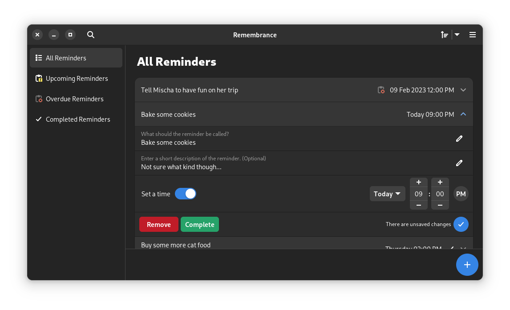

<div align="center">


# Remembrance, a simple reminder app for Linux

This is pre-release software, expect bugs.



</div>

## Installing dependencies (Flatpak):
```
flatpak install flathub org.gnome.Sdk//43
```

## Building (Flatpak):
```
flatpak-builder --user --install --force-clean build-dir com.github.dgsasha.Remembrance.yml
```
```
flatpak run com.github.dgsasha.Remembrance --restart-service
```

## Dependencies (generic):
- PyGObject
- Meson
- Libadwaita
- GLib

## Building (generic):
```
meson build
```
```
ninja -C build install
```
```
remembrance --restart-service
```

## Todo
Before first stable release:
- Add support for translations
- Add support for recurring reminders

Future plans:
- Make a GNOME Shell extension that lets you view (and maybe edit) your reminders
- Maybe integrate the search with GNOME Shell
- Possibly add some animations and UI improvements

## [DBus Service Documentation](REMEMBRANCE_SERVICE.md)